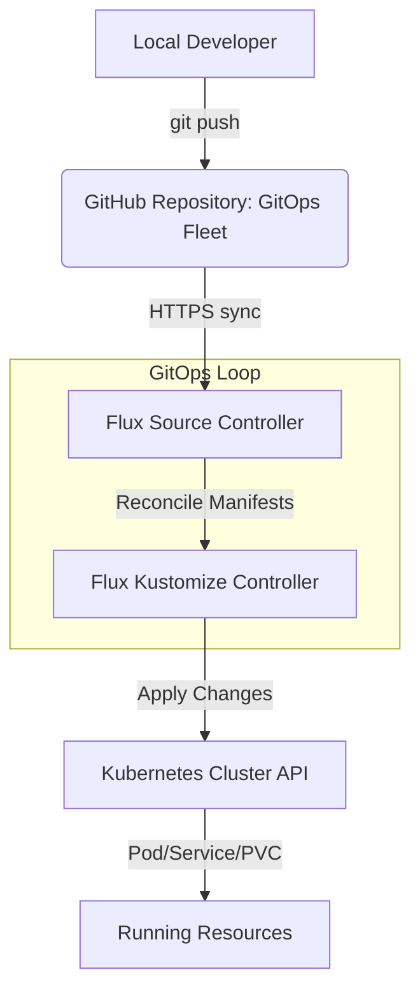

# Proxmox VE Talos Kubernetes Cluster with GitOps (Flux CD & GitHub)

This repository contains the Terraform configurations to deploy, bootstrap, and manage a secure, production-grade **Talos Linux Kubernetes Cluster** on **Proxmox Virtual Environment (VE)**. It integrates eBPF-powered **Cilium CNI**, local dynamic persistent storage, cluster monitoring, and git-based reconciliation (**Flux CD**) using a **GitHub repository** for fully automated GitOps.

> [!NOTE]
> **Project Scope: Day 0 to Day 1 GitOps Bootstrap**
>
> | Phase | Scope | Description | Status |
> |-------|-------|-------------|:------:|
> | **Day 0** | Infrastructure & CNI | Provision VMs on Proxmox, bootstrap Talos Linux, install Cilium (kube-proxy-free) and Local Path storage | ✅ Built-in |
> | **Day 1** | GitOps & Core Apps | Pre-deploy Metrics Server and Flux Operator to bootstrap GitOps reconciliation | ✅ Built-in |
> | **Day 2+** | App Workloads | Deploy workloads, ingress controllers, databases, etc. declaratively via the GitOps repo | 🔄 Managed via GitOps |

---

## 🚀 Key Features

- **Declarative Infrastructure**: Fully managed by Terraform using the `bpg/proxmox` and `siderolabs/talos` providers.
- **Talos Linux Node OS**: Security-hardened, minimal, immutable, and ephemeral Kubernetes node OS.
- **Cilium CNI (Kube-Proxy Replacement)**: High-performance routing, eBPF-based load balancing, L2 Announcements, and LoadBalancer IP pools (`192.168.100.200 - 192.168.100.240`).
- **Hubble Observability**: Real-time network visibility and flow logging with Hubble UI and Relay.
- **Dynamic Local Storage**: Rancher Local Path Provisioner configured at `/var/local-path-provisioner` (the persistent path on Talos Linux) as the default `local-path` StorageClass.
- **Automated GitOps (Flux CD)**: Installs the ControlPlane Flux Operator and applies the `FluxInstance` to sync the cluster state directly from a GitHub repository via HTTPS sync.
- **Flux Web UI**: Exposed via a static LoadBalancer IP (`192.168.100.202`) to monitor sync status.
- **Cluster Monitoring**: Metrics Server pre-installed along with [kubelet-serving-cert-approver.yaml](file:///Users/timi/lab-learn/k8s-tf-example/iac/terraform/proxmox/manifests/kubelet-serving-cert-approver.yaml) to automatically approve node Kubelet certificates on Talos.

---

## 📂 Project Structure

### Infrastructure-as-Code (Terraform)
All infrastructure-as-code files are located under the [iac/terraform/proxmox/](file:///Users/timi/lab-learn/k8s-tf-example/iac/terraform/proxmox) directory:
- **[main.tf](file:///Users/timi/lab-learn/k8s-tf-example/iac/terraform/proxmox/main.tf)**: Call to the local `modules/proxmox-talos` module to provision Proxmox VMs and initialize the Talos cluster.
- **[cilium.tf](file:///Users/timi/lab-learn/k8s-tf-example/iac/terraform/proxmox/cilium.tf)**: Installs the Cilium Helm chart, configures L2 announcement policies, LoadBalancer IP pools, and purges flannel/kube-proxy.
- **[local-storage.tf](file:///Users/timi/lab-learn/k8s-tf-example/iac/terraform/proxmox/local-storage.tf)**: Deploys Rancher Local Path Provisioner using the local Helm chart in `charts/local-path-provisioner`.
- **[flux.tf](file:///Users/timi/lab-learn/k8s-tf-example/iac/terraform/proxmox/flux.tf)**: Provisions the ControlPlane Flux Operator and bootstraps the `FluxInstance` CR pointing to the GitHub GitOps repository.
- **[metrics-server.tf](file:///Users/timi/lab-learn/k8s-tf-example/iac/terraform/proxmox/metrics-server.tf)**: Installs Metrics Server and `kubelet-serving-cert-approver` for node/pod resource usage statistics.
- **[outputs.tf](file:///Users/timi/lab-learn/k8s-tf-example/iac/terraform/proxmox/outputs.tf)**: Returns endpoints, node IPs, and configuration files.
- **[variables.tf](file:///Users/timi/lab-learn/k8s-tf-example/iac/terraform/proxmox/variables.tf)** & **[terraform.tfvars](file:///Users/timi/lab-learn/k8s-tf-example/iac/terraform/proxmox/terraform.tfvars)**: Customizable parameters (VM size, node IPs, GitHub owner/repo, etc.).
- **[scripts/](file:///Users/timi/lab-learn/k8s-tf-example/iac/terraform/proxmox/scripts)**:
  - **[set-config.sh](file:///Users/timi/lab-learn/k8s-tf-example/iac/terraform/proxmox/scripts/set-config.sh)**: Automates fetching `kubeconfig`/`talos_config` and writing them to standard local paths.
  - **[remove-tf.sh](file:///Users/timi/lab-learn/k8s-tf-example/iac/terraform/proxmox/scripts/remove-tf.sh)**: Helper to clean up local Terraform state files and cache (for developers).

### GitOps Resources
The GitOps configuration layout is located under the [gitops/](file:///Users/timi/lab-learn/k8s-tf-example/gitops) directory:
- **[gitops/homelab/](file:///Users/timi/lab-learn/k8s-tf-example/gitops/homelab)**:
  - **`clusters/homelab-cluster/`**: Contains the bootstrapping configurations:
    - **`flux-system/flux-instance.yaml`**: The **`FluxInstance`** custom resource configuration syncing from GitHub.
    - **`kustomization.yaml`**: Root Kustomization linking to all resources.
    - **`infrastructure.yaml`**: The Flux Kustomization linking to `./gitops/homelab/infrastructure`.
    - **`apps.yaml`**: The Flux Kustomization linking to `./gitops/homelab/apps` (depends on infrastructure).
  - **`infrastructure/`**: Core infrastructure workloads (e.g. [flux-operator-web-lb.yaml](file:///Users/timi/lab-learn/k8s-tf-example/gitops/homelab/infrastructure/flux-operator-web-lb.yaml) to expose the Flux Web UI).
  - **`apps/`**: Placeholders for application workloads managed via GitOps.

---

## 🛠️ Prerequisites

1. A running **Proxmox VE** instance (configured at `https://192.168.100.252:8006/` or customized in `terraform.tfvars`).
2. **Talos Linux OS image** uploaded to Proxmox.
3. **Terraform CLI**, **kubectl**, and **talosctl** installed locally.
4. Credentials configured via environment variables (`PROXMOX_VE_USERNAME`, `PROXMOX_VE_PASSWORD`).

---

## ⚡ Deployment & Setup Guide

### 1. Initialize and Apply Terraform
Navigate to the Terraform configuration directory, initialize the working directory, and apply the configuration to spin up the cluster and install all bootstrap applications:
```bash
cd iac/terraform/proxmox
terraform init
terraform apply
```

### 2. Configure Local Clients (kubeconfig & talosconfig)
From the `iac/terraform/proxmox` directory, run the helper script to generate the configuration files and copy them to standard directories (`~/.kube/config` and `~/.talos/config`):
```bash
./scripts/set-config.sh
```

You can now test access to the cluster:
```bash
kubectl get nodes -o wide
talosctl containers -n <control-plane-ip>
```

### 3. Verify Deployed Services
Check the statuses of the core services and their corresponding pods:
```bash
# Verify Cilium & storage
kubectl get pods -n kube-system
kubectl get sc

# Verify Flux
kubectl get pods -n flux-system
```

---

## 🔗 Service Endpoints & Access

Once deployment completes, the following services are available:

| Service | Protocol/URL | Default Credentials / Settings |
|---------|--------------|--------------------------------|
| **GitOps Repository** | `https://github.com/<github_owner>/<github_repository>` | The GitHub repository set in `github_owner` and `github_repository` variables. |
| **Flux Operator Web UI** | [http://192.168.100.202/](http://192.168.100.202/) | Access via web browser to inspect GitOps sync state |

---

## 🔄 Day 1 GitOps Reconciliation Flow

After the Day 0 Terraform apply completes, the cluster is automatically configured with a self-healing reconciliation loop:



To deploy new applications or modify cluster settings:
1. Clone your GitOps fleet repository from GitHub:
   ```bash
   git clone https://github.com/<github_owner>/<github_repository>.git
   ```
2. Place your Kubernetes manifests or Helm releases in `gitops/homelab/apps/` or `gitops/homelab/infrastructure/`.
3. Reference them in the `kustomization.yaml` under `gitops/homelab/clusters/homelab-cluster/`.
4. Commit and push your changes. Flux will apply them within minutes automatically.

---

## 🧹 Tear Down & Reset
To fully destroy the Kubernetes cluster and delete all resources from Proxmox, run the following from `iac/terraform/proxmox/`:
```bash
terraform destroy
```
If you wish to do a clean reset of the local Terraform states, run:
```bash
./scripts/remove-tf.sh -y
```
